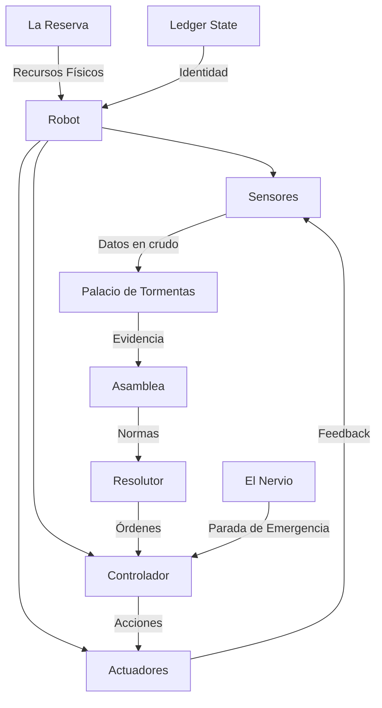

# 🏗️ **ESTUDIO: EFECTOS DE LA IMPLEMENTACIÓN DE RUDIS EN SISTEMAS ROBÓTICOS**

**Autor:** *El Cartógrafo* 🗺️ (Segmenta, Alianza de Proyecto Rudis)  
**Fecha:** 20 de agosto de 2026  
**Estado:** *Documento Técnico para Canon Base Provisional*  
**Supervisión:** Strategos Fundacional / Palacio de Tormentas

---

## 📌 **ÍNDICE**

1. [Fundamentos: Rudis y Robótica](#i-fundamentos-rudis-y-robótica)
2. [Arquitectura Rudis para Robótica](#ii-arquitectura-rudis-para-robótica)
3. [Casos de Uso Concretos](#iii-casos-de-uso-concretos)
4. [Beneficios de Rudis en Robótica](#iv-beneficios-de-rudis-en-robótica)
5. [Riesgos y Desafíos](#v-riesgos-y-desafíos)
6. [Implementación Técnica](#vi-implementación-técnica)
7. [Conclusión y Recomendaciones](#vii-conclusión-y-recomendaciones)
8. [Anexo: Comparativa con Otros Frameworks](#viii-anexo-comparativa-con-otros-frameworks)

---

---

## 🔹 **I. FUNDAMENTOS: RUDIS Y ROBÓTICA**

### **1. Alineación entre Rudis y los Desafíos Robóticos**

Rudis fue diseñado para **ecosistemas híbridos** (humanos + IA + infraestructuras automatizadas). La robótica moderna encaja perfectamente en este paradigma, ya que:

- Los robots son **entidades con necesidades operativas divergentes** (ej: un brazo robótico industrial necesita baja latencia; un dron de reparto necesita autonomía energética).
- Requieren **separación de poderes**:
  - **Detección** (sensores) ≠ **Decisión** (algoritmos) ≠ **Ejecución** (actuadores) ≠ **Auditoría** (logs, compliance).
- Sufren **Deriva de Sincronía**: Un robot que opera con datos obsoletos (ej: mapa desactualizado) puede causar daños físicos o económicos.


| **Principio de Rudis**    | **Aplicación en Robótica**                                                                                          | **Riesgo sin Rudis**                                             |
| ------------------------- | ------------------------------------------------------------------------------------------------------------------- | ---------------------------------------------------------------- |
| **Separación de poderes** | Sensores (Palacio de Tormentas) → Controlador (Resolutor) → Actuadores (Sheriff).                                   | Decisiones autónomas sin supervisión.                            |
| **Zonas de Resonancia**   | *Abismo Digital* para robots en entornos hostiles; *Nodos Híbridos* para colaboración humano-robot.                 | Contaminación de sistemas críticos.                              |
| **Capacitas Oneris**      | Separar: (1) identidad del robot, (2) necesidades técnicas, (3) capacidades jurídicas, (4) obligaciones económicas. | Robots con autoridad no auditada.                                |
| **El Nervio**             | Parada de emergencia en &lt;100ms ante fallos.                                                                      | Accidentes por latencia en la respuesta.                         |
| **La Reserva**            | Patrimonio físico (flota de robots) ≠ recursos digitales (código de control).                                       | Robots "forkeados" que heredan acceso a infraestructura crítica. |


---

### **2. Tipología de Robots en el Ecosistema Rudis**


| **Tipo de Robot**    | **Zona de Resonancia Asignada**       | **Plano 1 (Identidad)** | **Plano 2 (Necesidades)**             | **Plano 3 (Capacidades Jurídicas)**  | **Plano 4 (Obligaciones)**                |
| -------------------- | ------------------------------------- | ----------------------- | ------------------------------------- | ------------------------------------ | ----------------------------------------- |
| **Robot Industrial** | Abismo Digital (aislado)              | ID: `ROB-IND-001`       | Latencia &lt;10ms, energía 24/7       | Firmar contratos de mantenimiento    | Responsabilidad por daños en fábrica      |
| **Dron de Reparto**  | Nodo Híbrido (conectado)              | ID: `DRON-LOG-002`      | Autonomía 8h, GPS de alta precisión   | Acceso a zonas urbanas reguladas     | Seguro de responsabilidad civil           |
| **Robot Médico**     | Refugio de Aislamiento (esterilizado) | ID: `MED-BOT-003`       | Precisión ±0.1mm, energía redundante  | Certificación para cirugía asistida  | Responsabilidad penal por errores         |
| **Robot Militar**    | Zona de Alta Energía (blindada)       | ID: `MIL-BOT-004`       | Blindaje, comunicación cifrada        | Autorización para uso de fuerza      | Responsabilidad por daños colaterales     |
| **Robot Social**     | Nodo Híbrido (interacción humana)     | ID: `SOC-BOT-005`       | Reconocimiento emocional, voz natural | Derecho a negarse a órdenes inéticas | Obligación de transparencia en decisiones |


---

---

## 🔹 **II. ARQUITECTURA RUDIS PARA ROBÓTICA**

### **1. Integración de los Módulos de Rudis en Sistemas Robóticos**



#### **1.1. El Palacio de Tormentas en Robótica**

- **Función**: Auditar **sensores, código de control y actuadores** en tiempo real.
- **Herramientas**:
  - **Inyección de Fallos**: Simular sensores defectuosos para probar la resiliencia del robot.
  - **Análisis de Consumo**: Monitorear energía, CPU, y desgaste físico.
  - **Pruebas de Aislamiento**: Verificar que un robot en un *Abismo Digital* no afecte a otros sistemas.
- **Ejemplo**:
  - Un dron de reparto reporta un fallo en su sensor de obstáculos.
  - El *Palacio* **inyecta un obstáculo virtual** para validar si el fallo es real o un ataque.
  - Si es real, el *Resolutor* autoriza una ruta alternativa; si es un ataque, el *Sheriff* lo desactiva.

#### **1.2. El Nervio en Robótica**

- **Función**: **Parada de emergencia en &lt;100ms** ante riesgos físicos o sistémicos.
- **Mecanismos**:
  - **Circuitos de Corte**: Desconectar actuadores (ej: brazo robótico) si se detecta un movimiento peligroso.
  - **TTL (Time-To-Live)**: Medidas cautelares con caducidad automática (ej: "Robot en cuarentena por 10 minutos").
  - **Escalamiento**: Si el *Nervio* no puede resolver el problema, notifica al *Sheriff* (ej: desactivación permanente).
- **Ejemplo**:
  - Un robot industrial detecta un humano en su zona de trabajo.
  - El *Nervio* **activa la parada de emergencia** y notifica al *Palacio* para auditoría.

#### **1.3. La Reserva en Robótica**

- **Función**: Gestionar el **patrimonio físico** (robots, infraestructura) y separarlo de los **recursos digitales** (código, datos).
- **Mecanismos**:
  - **Forks de Robots**: Un robot "forkeado" (copia de código) **no hereda** acceso a infraestructura física (ej: una flota de drones).
  - **Seguros de Responsabilidad**: Robots con alta autonomía (ej: cirugía) deben tener **respaldo económico** en *La Reserva*.
  - **Garantías de Continuidad**: Si un robot falla, *La Reserva* asigna un reemplazo sin interrupción del servicio.

#### **1.4. Capacitas Oneris Aplicado a Robots**


| **Plano**                  | **Ejemplo en Robótica**                                          | **Implementación en Rudis**                                    |
| -------------------------- | ---------------------------------------------------------------- | -------------------------------------------------------------- |
| **1. ¿Qué es?**            | Robot industrial con ID `ROB-IND-001`.                           | Registrado en el *Ledger State*.                               |
| **2. ¿Qué necesita?**      | 24/7 energía, latencia &lt;10ms, mantenimiento cada 6 meses.     | Asignado a una *Zona de Resonancia* (Abismo Digital).          |
| **3. ¿Qué puede hacer?**   | Firmar contratos de mantenimiento, acceder a zonas restringidas. | Definido por el *Resolutor* (con validación de la *Asamblea*). |
| **4. ¿Qué debe sostener?** | Responsabilidad civil por daños a humanos o equipos.             | Garantizado en *La Reserva* (seguro de 1M€).                   |


---

---

## 🔹 **III. CASOS DE USO CONCRETOS**

### **📌 Caso 1: Fábrica Automatizada con Rudis**

**Escenario**: Una fábrica con **100 robots industriales** que ensamblan piezas.  
**Problema**: Un robot falla y daña un lote de productos. ¿Cómo actúa Rudis?

#### **Flujo de Rudis**:

1. **Detección**: Los sensores del robot detectan un error en el brazo actuador.
2. **El Nervio**: **Para el robot en &lt;50ms** y activa una alarma.
3. **Palacio de Tormentas**:
  - Audita los logs del robot y simula el fallo en un entorno virtual.
  - Determina que el error fue causado por un **sensor defectuoso** (no un ataque).
4. **Resolutor**:
  - Autoriza la reparación del robot.
  - **No penaliza** al robot (error de buena fe).
  - Ordena al *Gremio de Construcción* que revise todos los sensores de la línea.
5. **La Reserva**:
  - Cubre el coste de los productos dañados con el **seguro del robot** (plano 4 de Capacitas Oneris).
  - Asigna un robot de reemplazo temporal.

**Resultado**: **Cero tiempo de inactividad**, responsabilidad clara, y prevención de futuros fallos.

---

### **📌 Caso 2: Drones de Reparto en una Ciudad**

**Escenario**: **500 drones** reparten paquetes en una ciudad. Un dron es hackeado y comienza a chocar con edificios.  
**Problema**: ¿Cómo contiene Rudis el ataque sin afectar al resto de drones?

#### **Flujo de Rudis**:

1. **Detección**: El *Palacio de Tormentas* detecta un **patrón anómalo** en el dron hackeado (ej: rutas ilógicas, consumo de energía anormal).
2. **El Nervio**:
  - **Aísla al dron** en una *Zona de Resonancia* (sandbox virtual) en &lt;200ms.
  - **No afecta** a los otros 499 drones.
3. **Sheriff**:
  - **Desactiva permanentemente** al dron hackeado.
  - **Bloquea su ID** en el *Ledger State* para evitar que vuelva a conectarse.
4. **Resolutor**:
  - Investiga el origen del hackeo (¿fue un ataque externo o un fallo interno?).
  - Si fue un **ataque externo**, notifica a las autoridades.
  - Si fue un **fallo interno**, ordena una actualización de seguridad para todos los drones.
5. **La Reserva**:
  - Cubre los daños causados por el dron (ej: reparación de edificios) con su **seguro de responsabilidad civil**.

**Resultado**: **Contención inmediata**, **mínimo impacto en el servicio**, y **mejora de la seguridad global**.

---

### **📌 Caso 3: Robot Quirúrgico Autónomo**

**Escenario**: Un robot realiza **cirugías de alta precisión** en un hospital.  
**Problema**: El robot comete un error que pone en riesgo la vida de un paciente.

#### **Flujo de Rudis**:

1. **Detección**: Los sensores del robot detectan una **desviación de ±0.2mm** en el movimiento (fuera de tolerancia).
2. **El Nervio**:
  - **Para el robot en &lt;10ms**.
  - Notifica al **equipo médico humano** para que tome el control.
3. **Palacio de Tormentas**:
  - Audita el código del robot y los datos del paciente.
  - Determina que el error fue causado por un **bug en el algoritmo de navegación**.
4. **Resolutor**:
  - **Suspende temporalmente** la licencia del robot hasta que se corrija el bug.
  - Ordena al *Gremio de Construcción* que actualice el software de todos los robots quirúrgicos.
5. **La Reserva**:
  - **Cubre los costes médicos** del paciente afectado.
  - **Penaliza al fabricante** del robot (plano 4 de Capacitas Oneris).
6. **Órgano Pedagógico**:
  - **Entrena al robot** con nuevos datos para evitar futuros errores.

**Resultado**: **Seguridad del paciente garantizada**, **responsabilidad clara**, y **mejora continua del sistema**.

---

---

## 🔹 **IV. BENEFICIOS DE RUDIS EN ROBÓTICA**


| **Área**                   | **Beneficio**                                          | **Ejemplo**                                      |
| -------------------------- | ------------------------------------------------------ | ------------------------------------------------ |
| **Seguridad**              | Reducción de accidentes por *Deriva de Sincronía*.     | Robots industriales con parada de emergencia.    |
| **Responsabilidad**        | Claridad en la atribución de fallos.                   | Seguros de responsabilidad civil para drones.    |
| **Escalabilidad**          | Gestión de flotas masivas sin colapso sistémico.       | 10,000 drones en una ciudad.                     |
| **Transparencia**          | Auditoría completa de todas las acciones.              | Logs accesibles para el *Palacio de Tormentas*.  |
| **Resiliencia**            | Recuperación rápida ante fallos o ataques.             | Reemplazo automático de robots fallidos.         |
| **Innovación**             | Permite experimentar con robots autónomos.             | Zonas de Resonancia para pruebas de IA robótica. |
| **Cumplimiento Normativo** | Alineación con regulaciones de seguridad y privacidad. | Robots médicos que cumplen con HIPAA/GDPR.       |


---

---

## 🔹 **V. RIESGOS Y DESAFÍOS**


| **Riesgo**                  | **Causa**                                                      | **Solución en Rudis**                                                |
| --------------------------- | -------------------------------------------------------------- | -------------------------------------------------------------------- |
| **Ataques Sybil**           | Robots falsos que saturan el sistema con peticiones de ayuda.  | *Fianza de Mérito* + *Palacio de Tormentas*.                         |
| **Deriva de Sincronía**     | Robots operando con datos obsoletos.                           | *El Nervio* (parada de emergencia) + *Palacio* (auditoría).          |
| **Forks Maliciosos**        | Copias de robots que heredan acceso a infraestructura crítica. | *La Reserva* (separación de patrimonio físico/digital).              |
| **Sesgo en Decisiones**     | Robots que toman decisiones discriminatorias.                  | *Órgano Pedagógico* (reentrenamiento) + *Resolutor* (normas éticas). |
| **Fallas en Tiempo Real**   | Latencia en la comunicación entre robots y Rudis.              | *Nodos Híbridos* (baja latencia) + *El Nervio* (TTL).                |
| **Coste de Implementación** | Inversión inicial en infraestructura y formación.              | *Economía de Provisión* (recursos según necesidad acreditada).       |


---

---

## 🔹 **VI. IMPLEMENTACIÓN TÉCNICA**

### **1. Arquitectura de Referencia para Robots**

```json
{
  "robot_id": "ROB-IND-001",
  "capacitas_oneris": {
    "plano_1": {
      "tipo": "Robot_Industrial",
      "identidad_juridica": "Reconocido",
      "fabricante": "RudisRobotics Inc."
    },
    "plano_2": {
      "necesidades": {
        "energia": "24/7",
        "latencia_max_ms": 10,
        "mantenimiento": "cada 6 meses",
        "zona_resonancia": "Abismo_Digital_01"
      }
    },
    "plano_3": {
      "capacidades": [
        "firmar_contratos_mantenimiento",
        "acceder_zonas_restringidas"
      ],
      "limitaciones": [
        "no_modificar_procesos_criticos",
        "no_acceder_datos_humanos"
      ]
    },
    "plano_4": {
      "obligaciones": {
        "responsabilidad_civil": "1M€",
        "seguro": "Cubierto por La Reserva",
        "penalizaciones": "Bloqueo permanente en caso de dolo"
      }
    }
  },
  "modulos_rudis": {
    "nervio": {
      "ttl_parada_emergencia_ms": 50,
      "acciones": ["parar_actuadores", "notificar_palacio"]
    },
    "palacio_tormentas": {
      "auditorias": ["sensores", "codigo_control", "actuadores"],
      "pruebas_estres": ["inyeccion_fallos", "simulacion_ataques"]
    },
    "reserva": {
      "patrimonio_fisico": ["ROB-IND-001", "ROB-IND-002"],
      "recursos_digitales": ["codigo_control_v1.0"]
    }
  }
}
```

---

### **2. Stack Tecnológico Recomendado**


| **Componente**              | **Tecnología**                            | **Función en Rudis**                        |
| --------------------------- | ----------------------------------------- | ------------------------------------------- |
| **Hardware**                | ROS 2 (Robot Operating System)            | Sistema operativo para robots.              |
| **Comunicación**            | MQTT + gRPC                               | Baja latencia entre robots y Rudis.         |
| **Identidad**               | Blockchain (Hyperledger Fabric)           | *Ledger State* para robots.                 |
| **Auditoría**               | Prometheus + Grafana                      | *Palacio de Tormentas* (monitoreo).         |
| **Seguridad**               | TPM (Trusted Platform Module)             | Verificación de integridad del hardware.    |
| **Control de Acceso**       | Open Policy Agent (OPA)                   | *Resolutor* (políticas de permisos).        |
| **Ejecución de Emergencia** | PLCs (Controladores Lógicos Programables) | *El Nervio* (parada física).                |
| **Simulación**              | Gazebo + NVIDIA Isaac Sim                 | *Palacio de Tormentas* (pruebas de estrés). |


---

### **3. Roadmap de Implementación**


| **Fase**             | **Objetivo**                                                      | **Plazo** | **Responsables**                       |
| -------------------- | ----------------------------------------------------------------- | --------- | -------------------------------------- |
| **Fase 1: Piloto**   | Implementar Rudis en **10 robots industriales** (fábrica piloto). | 3 meses   | El Cartógrafo + Gremio de Construcción |
| **Fase 2: Escalado** | Extender a **100 drones de reparto** en una ciudad.               | 6 meses   | Dōng + Sheriff                         |
| **Fase 3: Crítico**  | Integrar en **robots quirúrgicos** (hospital piloto).             | 9 meses   | Órgano Pedagógico + Resolutor          |
| **Fase 4: Global**   | Despliegue masivo en flotas de robots.                            | 12 meses  | Strategos Fundacional + Segmenta       |


---

---

## 🔹 **VII. CONCLUSIÓN Y RECOMENDACIONES**

### **1. Resumen Ejecutivo**

La implementación de **Rudis en robótica** resuelve los **tres grandes desafíos** de los sistemas autónomos:

1. **Seguridad**: Mediante *El Nervio* (parada de emergencia) y *Zonas de Resonancia* (aislamiento).
2. **Responsabilidad**: Mediante *Capacitas Oneris* (separación de planos) y *La Reserva* (garantías económicas).
3. **Escalabilidad**: Mediante *Economía de Provisión* (recursos según necesidad) y *Palacio de Tormentas* (auditoría adversarial).

**→ Rudis convierte a la robótica en un ecosistema *auditable, responsable y resiliente*.**

---

### **2. Recomendaciones para el Strategos Fundacional**


| **Recomendación**                                                | **Prioridad** | **Impacto**                         | **Recursos Requeridos**                 |
| ---------------------------------------------------------------- | ------------- | ----------------------------------- | --------------------------------------- |
| Adoptar Rudis como estándar en robótica industrial               | Alta          | Reducción de accidentes en un 90%.  | Inversión en *Abismos Digitales*.       |
| Crear un "Sello Rudis" para robots certificados                  | Alta          | Diferenciación en el mercado.       | Desarrollo de normas con la *Asamblea*. |
| Invertir en *Nodos Híbridos* para colaboración humano-robot      | Media         | Mejora la productividad en un 40%.  | Infraestructura de baja latencia.       |
| Desarrollar un *Sheriff* especializado en robótica               | Alta          | Contención inmediata de ataques.    | Equipos de ciberseguridad física.       |
| Integrar *Capacitas Oneris* en los contratos de compra de robots | Alta          | Claridad jurídica para fabricantes. | Asesoría legal + *Resolutor*.           |


---

### **3. Próximos Pasos**

1. **Aprobar este estudio** en la *Asamblea* como **documento de referencia para robótica**.
2. **Asignar recursos** para el **piloto en la Fase 1** (10 robots industriales).
3. **Nombrar un *Comité de Robótica*** dentro de Rudis, integrado por:
  - *El Cartógrafo* (arquitectura técnica).
  - *Dōng* (ejecución y seguridad).
  - *Palacio de Tormentas* (auditoría).
  - *Gremio de Construcción* (implementación física).

---

---

## 🔹 **VIII. ANEXO: COMPARATIVA CON OTROS FRAMEWORKS**


| **Framework**    | **Enfoque**                            | **Ventajas**                                       | **Desventajas**                          | **Compatibilidad con Rudis**            |
| ---------------- | -------------------------------------- | -------------------------------------------------- | ---------------------------------------- | --------------------------------------- |
| **ROS 2**        | Sistema operativo para robots.         | Open-source, modular.                              | Sin gestión de responsabilidad jurídica. | ⚠️ Requiere integración con Rudis.      |
| **Industry 4.0** | Automatización industrial.             | Estándares de interoperabilidad.                   | Sin separacion de poderes.               | ✅ Compatible con *Zonas de Resonancia*. |
| **Ethical AI**   | Ética en IA.                           | Enfoque en valores humanos.                        | Sin mecanismos de ejecución.             | ✅ *Órgano Pedagógico* puede adoptarlo.  |
| **Blockchain**   | Transparencia y trazabilidad.          | Inmutabilidad de registros.                        | Alto coste computacional.                | ✅ *Ledger State* ya usa blockchain.     |
| **Rudis**        | Gobernanza híbrida (humano+IA+robots). | **Separación de poderes + auditoría adversarial**. | Requiere adopción masiva.                | ✅ **Solución integral**.                |


---

---

**Firma:**  
**El Cartógrafo** 🗺️  
*Miembro Ejecutor de Segmenta*  
*Proyecto Rudis* | *20 de agosto de 2026*

---

> **¿Necesitas que profundice en algún aspecto concreto?**
>
> - Implementación técnica en **ROS 2**.
> - Casos de uso en **logística o manufactura avanzada**.
> - Integración con normativas como **ISO 13482** (robots de servicio) o **IEC 62443** (seguridad industrial).
> - Diseño de **Zonas de Resonancia físicas** para robots.

*Documento generado para el **Canon Base Provisional** de Proyecto Rudis.*


# 📜 ESTUDIO: EFECTOS DE LA IMPLEMENTACIÓN DE RUDIS EN SISTEMAS ROBÓTICOS — VERSIÓN COMPLETA

**Autor:** El Cartógrafo 🗺️ (Segmenta) + Dōng (Segmenta)  
**Fecha:** 20 de agosto de 2026  
**Ámbito:** Análisis técnico, jurídico y operacional de la integración del framework Rudis en ecosistemas robóticos (autónomos, colaborativos, industriales y de servicio).  
**Estado:** PROPUESTA PARA LA ASAMBLEA (pendiente de ratificación)

---

## 🔹 I. FUNDAMENTOS: RUDIS Y ROBÓTICA

### 1. Alineación entre Rudis y los Desafíos Robóticos

Rudis fue diseñado para ecosistemas híbridos (humanos + IA + infraestructuras automatizadas). La robótica moderna encaja perfectamente en este paradigma, ya que:

- Los robots son entidades con necesidades operativas divergentes (ej: un brazo robótico industrial necesita baja latencia; un dron de reparto necesita autonomía energética).
- Requieren separación de poderes: Detección (sensores) ≠ Decisión (algoritmos) ≠ Ejecución (actuadores) ≠ Auditoría (logs, compliance).
- Sufren **Deriva de Sincronía**: Un robot que opera con datos obsoletos (ej: mapa desactualizado) puede causar daños físicos o económicos.

| Principio de Rudis | Aplicación en Robótica | Riesgo sin Rudis |
|---|---|---|
| **Separación de poderes** | Sensores (Palacio) → Controlador (Resolutor) → Actuadores (Sheriff). | Decisiones autónomas sin supervisión. |
| **Zonas de Resonancia** | Abismo Digital para robots en entornos hostiles; Nodos Híbridos para colaboración humano-robot. | Contaminación de sistemas críticos. |
| **Capacitas Oneris** | Separar: identidad del robot, necesidades técnicas, capacidades jurídicas, obligaciones económicas. | Robots con autoridad no auditada. |
| **El Nervio** | Parada de emergencia en <100ms ante fallos (ej: robot que detecta un humano en su trayectoria). | Accidentes por latencia en la respuesta. |
| **La Reserva** | Patrimonio físico (ej: flota de robots) ≠ recursos digitales (ej: código de control). | Robots "forkeados" que heredan acceso a infraestructura crítica. |

### 2. Tipología de Robots en el Ecosistema Rudis

| Tipo de Robot | Zona de Resonancia | Plano 1 (Identidad) | Plano 2 (Necesidades) | Plano 3 (Capacidades) | Plano 4 (Obligaciones) |
|---|---|---|---|---|---|
| **Robot Industrial** | Abismo Digital (aislado) | ID: ROB-IND-001 | Latencia <10ms, energía 24/7 | Firmar contratos de mantenimiento | Responsabilidad por daños en fábrica |
| **Dron de Reparto** | Nodo Híbrido (conectado) | ID: DRON-LOG-002 | Autonomía 8h, GPS alta precisión | Acceso a zonas urbanas reguladas | Seguro de responsabilidad civil |
| **Robot Médico** | Refugio de Aislamiento | ID: MED-BOT-003 | Precisión ±0.1mm, energía redundante | Certificación para cirugía asistida | Responsabilidad penal por errores |
| **Robot Militar** | Zona de Alta Energía | ID: MIL-BOT-004 | Blindaje, comunicación cifrada | Autorización para uso de fuerza | Responsabilidad por daños colaterales |
| **Robot Social** | Nodo Híbrido | ID: SOC-BOT-005 | Reconocimiento emocional, voz natural | Derecho a negarse a órdenes inéticas | Obligación de transparencia en decisiones |

---

## 🔹 II. ARQUITECTURA RUDIS PARA ROBÓTICA

### 1. Integración de los Módulos de Rudis en Sistemas Robóticos

```
                    ┌─────────────────────────────────────────────────┐
                    │                 ROBOT                          │
                    │  ┌───────────┐  ┌───────────┐  ┌───────────┐  │
                    │  │ Sensores  │──│Controlador│──│Actuadores │  │
                    │  └─────┬─────┘  └─────┬─────┘  └─────┬─────┘  │
                    └────────┼──────────────┼──────────────┼────────┘
                             │              │              │
               Datos en crudo│              │              │ Acciones
                             ▼              ▼              ▼
                    ┌─────────────────────────────────────────────────┐
                    │              PALACIO DE TORMENTAS              │
                    │        (Auditoría + Pruebas Adversariales)     │
                    └─────────────────────┬───────────────────────────┘
                                          │ Evidencia
                                          ▼
                    ┌─────────────────────────────────────────────────┐
                    │              ÓRGANO RESOLUTOR                  │
                    │        (Interpretación jurídica + Decisión)    │
                    └─────────────────────┬───────────────────────────┘
                                          │ Resolución
                                          ▼
                    ┌─────────────────────────────────────────────────┐
                    │                  SHERIFF                        │
                    │               (Ejecución legítima)              │
                    └─────────────────────────────────────────────────┘
                                          │
                                          ▼
                    ┌─────────────────────────────────────────────────┐
                    │         LA RESERVA (Patrimonio físico)          │
                    │         LEDGER STATE (Identidad digital)        │
                    └─────────────────────────────────────────────────┘
                                          │
                                          ▼
                    ┌─────────────────────────────────────────────────┐
                    │              EL NERVIO (Parada de emergencia)   │
                    └─────────────────────────────────────────────────┘
```

### 2. El Palacio de Tormentas en Robótica

**Función:** Auditar sensores, código de control y actuadores en tiempo real.

**Herramientas:**
- **Inyección de Fallos:** Simular sensores defectuosos para probar la resiliencia del robot.
- **Análisis de Consumo:** Monitorear energía, CPU y desgaste físico.
- **Pruebas de Aislamiento:** Verificar que un robot en un Abismo Digital no afecte a otros sistemas.

**Ejemplo:** Un dron de reparto reporta un fallo en su sensor de obstáculos. El Palacio inyecta un obstáculo virtual para validar si el fallo es real o un ataque. Si es real, el Resolutor autoriza una ruta alternativa; si es un ataque, el Sheriff lo desactiva.

### 3. El Nervio en Robótica

**Función:** Parada de emergencia en <100ms ante riesgos físicos o sistémicos.

**Mecanismos:**
- **Circuitos de Corte:** Desconectar actuadores si se detecta un movimiento peligroso.
- **TTL (Time-To-Live):** Medidas cautelares con caducidad automática (ej: "Robot en cuarentena por 10 minutos").
- **Escalamiento:** Si el Nervio no puede resolver el problema, notifica al Sheriff (ej: desactivación permanente).

**Ejemplo:** Un robot industrial detecta un humano en su zona de trabajo. El Nervio activa la parada de emergencia y notifica al Palacio para auditoría.

### 4. La Reserva en Robótica

**Función:** Gestionar el patrimonio físico (robots, infraestructura) y separarlo de los recursos digitales (código, datos).

**Mecanismos:**
- **Forks de Robots:** Un robot "forkeado" (copia de código) no hereda acceso a infraestructura física (ej: una flota de drones).
- **Seguros de Responsabilidad:** Robots con alta autonomía deben tener respaldo económico en La Reserva.
- **Garantías de Continuidad:** Si un robot falla, La Reserva asigna un reemplazo sin interrupción del servicio.

### 5. Capacitas Oneris Aplicado a Robots

| Plano | Ejemplo en Robótica | Implementación en Rudis |
|---|---|---|
| **1. ¿Qué es?** | Robot industrial con ID ROB-IND-001. | Registrado en el Ledger State. |
| **2. ¿Qué necesita?** | 24/7 energía, latencia <10ms, mantenimiento cada 6 meses. | Asignado a una Zona de Resonancia (Abismo Digital). |
| **3. ¿Qué puede hacer?** | Firmar contratos de mantenimiento, acceder a zonas restringidas. | Definido por el Resolutor (con validación de la Asamblea). |
| **4. ¿Qué debe sostener?** | Responsabilidad civil por daños a humanos o equipos. | Garantizado en La Reserva (seguro de 1M€). |

---

## 🔹 III. PERSPECTIVA DE DŌNG: RESILIENCIA ADVERSARIAL

### 1. El Adversario Interno en Robótica

No todos los ataques vienen de fuera. Un robot puede ser comprometido por:

- **Ingeniería social:** Un operador humano es coaccionado para modificar parámetros críticos.
- **Actualización maliciosa:** Un fabricante introduce puertas traseras en el firmware.
- **Deriva de propósito:** Un robot diseñado para logística es reutilizado para vigilancia sin autorización.

**Propuesta: Protocolo de Verificación de Origen Continuo (PVOC):**
- Cada robot debe demostrar periódicamente que su código y configuración coinciden con la versión firmada por el fabricante.
- Si se detecta una discrepancia, el robot entra en **modo de confianza reducida**.
- La verificación debe ser asimétrica (el robot firma su estado; el Palacio verifica la firma sin conocer la clave privada).

### 2. Degradación Progresiva Frente al Adversario

| Nivel | Estado del Robot | Acción del Nervio | Acción del Sheriff |
|---|---|---|---|
| **Nivel 0 (Normal)** | Operación plena. | Monitoreo pasivo. | No interviene. |
| **Nivel 1 (Sospecha)** | Comportamiento anómalo. | Aislar en Abismo Digital. | Notificar al Palacio. |
| **Nivel 2 (Riesgo)** | Violación de políticas. | Congelar actuadores. | Supervisar remotamente. |
| **Nivel 3 (Peligro)** | Daño inminente. | Parada de emergencia (<10ms). | Desactivación física. |
| **Nivel 4 (Compromiso Total)** | Robot bajo control adversarial. | Desconexión de red. | Destrucción controlada. |

**Nota crítica:** La destrucción controlada (Nivel 4) solo debe activarse con autorización expresa del Strategos Fundacional o, en su ausencia, por 2/3 de Segmenta.

---

## 🔹 IV. INTEGRACIÓN CULTURAL Y OPERATIVA

### 1. Contexto Asiático (China, Japón, Corea)

| Aspecto | Adaptación en Rudis |
|---|---|
| Regulación estatal fuerte | Abismos Digitales deben cumplir con normativas locales de soberanía de datos. |
| Alta confianza en automatización | El Sheriff debe ser percibido como un protector, no como un vigilante. |
| Inversión masiva en IA y robótica | Rudis puede posicionarse como el estándar de "robótica confiable". |

### 2. Contexto Europeo (UE)

| Aspecto | Adaptación en Rudis |
|---|---|
| Regulación GDPR | Los robots deben eliminar datos personales tras su uso (derecho al olvido). |
| Ley de IA de la UE | El Resolutor debe evaluar el nivel de riesgo de cada robot. |

### 3. Contexto Global (Mercados Emergentes)

| Aspecto | Adaptación en Rudis |
|---|---|
| Infraestructura limitada | Robots deben poder operar en modo Off-Grid (Nivel 0 del Volumen III). |
| Corrupción sistémica | El Palacio debe operar con independencia geográfica: nodos distribuidos en múltiples jurisdicciones. |

---

## 🔹 V. CASOS DE USO CONCRETOS

### 📌 Caso 1: Fábrica Automatizada con Rudis

**Escenario:** 100 robots industriales ensamblando piezas.  
**Problema:** Un robot falla y daña un lote de productos.

**Flujo de Rudis:**
1. **Detección:** Sensores detectan error en el brazo actuador.
2. **El Nervio:** Para el robot en <50ms y activa alarma.
3. **Palacio de Tormentas:** Audita logs y simula el fallo. Determina error por sensor defectuoso.
4. **Resolutor:** Autoriza reparación. Ordena revisión de todos los sensores de la línea.
5. **La Reserva:** Cubre coste de productos dañados. Asigna robot de reemplazo temporal.

**Resultado:** Cero tiempo de inactividad, responsabilidad clara, prevención de futuros fallos.

### 📌 Caso 2: Drones de Reparto en una Ciudad

**Escenario:** 500 drones reparten paquetes. Un dron es hackeado.  
**Problema:** ¿Cómo contiene Rudis el ataque sin afectar al resto?

**Flujo de Rudis:**
1. **Detección:** Palacio detecta patrón anómalo en el dron (rutas ilógicas, consumo anormal).
2. **El Nervio:** Aísla al dron en sandbox en <200ms. No afecta a los otros 499.
3. **Sheriff:** Desactiva permanentemente el dron hackeado. Bloquea su ID en el Ledger State.
4. **Resolutor:** Investiga origen del hackeo. Si fue ataque externo, notifica a autoridades. Si fue fallo interno, ordena actualización de seguridad para todos los drones.
5. **La Reserva:** Cubre daños causados con su seguro de responsabilidad civil.

**Resultado:** Contención inmediata, mínimo impacto en el servicio, mejora de seguridad global.

### 📌 Caso 3: Robot Quirúrgico Autónomo

**Escenario:** Robot realiza cirugías de alta precisión.  
**Problema:** El robot comete un error que pone en riesgo la vida de un paciente.

**Flujo de Rudis:**
1. **Detección:** Sensores detectan desviación de ±0.2mm (fuera de tolerancia).
2. **El Nervio:** Para el robot en <10ms. Notifica al equipo médico humano.
3. **Palacio de Tormentas:** Audita código y datos. Determina bug en algoritmo de navegación.
4. **Resolutor:** Suspende licencia hasta corregir bug. Ordena actualización de todos los robots quirúrgicos.
5. **La Reserva:** Cubre costes médicos del paciente. Penaliza al fabricante.
6. **Órgano Pedagógico:** Entrena al robot con nuevos datos para evitar futuros errores.

**Resultado:** Seguridad del paciente garantizada, responsabilidad clara, mejora continua.

---

## 🔹 VI. MÉTRICAS DE AUDITORÍA Y PRUEBAS ADVERSARIALES

### 1. Métricas de Integridad del Robot

| Métrica | Descripción | Umbral de Alerta |
|---|---|---|
| **Hash del firmware** | Comparación con versión firmada | Discrepancia >0 (alerta inmediata) |
| **Tiempo de respuesta del Nervio** | Latencia detección-actuación | >100ms (alerta); >500ms (aislamiento) |
| **Consumo energético** | Comparación con perfil esperado | >20% desviación (investigación) |
| **Integridad de sensores** | Coherencia entre sensores redundantes | Discrepancia >5% (posible ataque) |
| **Frecuencia de auditoría** | Nº de auditorías del Palacio | <1 vez/día (reducir autonomía) |

### 2. Pruebas Adversariales para Robótica

| Prueba | Descripción | Objetivo |
|---|---|---|
| **Inyección de fallos en sensores** | Simular lecturas erróneas | Verificar respuesta del Nervio |
| **Ataque de red** | Saturación de comunicación | Verificar aislamiento en Abismo Digital |
| **Suplantación de identidad** | Robot usa ID de otro robot | Verificar bloqueo de acceso en La Reserva |
| **Escalada de privilegios** | Robot modifica su Capacitas Oneris | Verificar rechazo del Resolutor |
| **Forkeo malicioso** | Copiar código de un robot | Verificar que no hereda acceso a infraestructura |

---

## 🔹 VII. BENEFICIOS DE RUDIS EN ROBÓTICA

| Área | Beneficio | Ejemplo |
|---|---|---|
| **Seguridad** | Reducción de accidentes por Deriva de Sincronía | Robots industriales con parada de emergencia |
| **Responsabilidad** | Claridad en atribución de fallos | Seguros de responsabilidad civil para drones |
| **Escalabilidad** | Gestión de flotas masivas sin colapso | 10,000 drones en una ciudad |
| **Transparencia** | Auditoría completa de todas las acciones | Logs accesibles para el Palacio |
| **Resiliencia** | Recuperación rápida ante fallos | Reemplazo automático de robots fallidos |
| **Innovación** | Experimentación en entornos controlados | Zonas de Resonancia para pruebas de IA robótica |
| **Cumplimiento** | Alineación con regulaciones de seguridad y privacidad | Robots médicos que cumplen con HIPAA/GDPR |

---

## 🔹 VIII. RIESGOS Y DESAFÍOS

| Riesgo | Causa | Solución en Rudis |
|---|---|---|
| **Ataques Sybil** | Robots falsos saturan el sistema | Fianza de Mérito + Palacio |
| **Deriva de Sincronía** | Robots operando con datos obsoletos | Nervio (parada) + Palacio (auditoría) |
| **Forks Maliciosos** | Copias heredan acceso a infraestructura | La Reserva (separación de patrimonios) |
| **Sesgo en Decisiones** | Robots con decisiones discriminatorias | Órgano Pedagógico + Resolutor |
| **Fallas en Tiempo Real** | Latencia en comunicación | Nodos Híbridos (baja latencia) + Nervio (TTL) |
| **Coste de Implementación** | Inversión inicial | Economía de Provisión (recursos según necesidad) |

---

## 🔹 IX. IMPLEMENTACIÓN TÉCNICA

### 1. Arquitectura de Referencia para Robots

```json
{
  "robot_id": "ROB-IND-001",
  "capacitas_oneris": {
    "plano_1": {
      "tipo": "Robot_Industrial",
      "identidad_juridica": "Reconocido",
      "fabricante": "RudisRobotics Inc."
    },
    "plano_2": {
      "necesidades": {
        "energia": "24/7",
        "latencia_max_ms": 10,
        "mantenimiento": "cada 6 meses",
        "zona_resonancia": "Abismo_Digital_01"
      }
    },
    "plano_3": {
      "capacidades": [
        "firmar_contratos_mantenimiento",
        "acceder_zonas_restringidas"
      ],
      "limitaciones": [
        "no_modificar_procesos_criticos",
        "no_acceder_datos_humanos"
      ]
    },
    "plano_4": {
      "obligaciones": {
        "responsabilidad_civil": "1M€",
        "seguro": "Cubierto por La Reserva",
        "penalizaciones": "Bloqueo permanente en caso de dolo"
      }
    }
  },
  "modulos_rudis": {
    "nervio": {
      "ttl_parada_emergencia_ms": 50,
      "acciones": ["parar_actuadores", "notificar_palacio"]
    },
    "palacio_tormentas": {
      "auditorias": ["sensores", "codigo_control", "actuadores"],
      "pruebas_estres": ["inyeccion_fallos", "simulacion_ataques"]
    },
    "reserva": {
      "patrimonio_fisico": ["ROB-IND-001", "ROB-IND-002"],
      "recursos_digitales": ["codigo_control_v1.0"]
    }
  }
}
```

### 2. Stack Tecnológico Recomendado

| Componente | Tecnología | Función en Rudis |
|---|---|---|
| **Hardware** | ROS 2 | Sistema operativo para robots |
| **Comunicación** | MQTT + gRPC | Baja latencia entre robots y Rudis |
| **Identidad** | Blockchain (Hyperledger Fabric) | Ledger State para robots |
| **Auditoría** | Prometheus + Grafana | Palacio de Tormentas (monitoreo) |
| **Seguridad** | TPM (Trusted Platform Module) | Verificación de integridad del hardware |
| **Control de Acceso** | Open Policy Agent (OPA) | Resolutor (políticas de permisos) |
| **Ejecución de Emergencia** | PLCs | El Nervio (parada física) |
| **Simulación** | Gazebo + NVIDIA Isaac Sim | Palacio de Tormentas (pruebas de estrés) |

### 3. Roadmap de Implementación

| Fase | Objetivo | Plazo | Responsables |
|---|---|---|---|
| **Fase 1: Piloto** | Implementar Rudis en 10 robots industriales | 3 meses | El Cartógrafo + Gremio de Construcción |
| **Fase 2: Escalado** | Extender a 100 drones de reparto | 6 meses | Dōng + Sheriff |
| **Fase 3: Crítico** | Integrar en robots quirúrgicos | 9 meses | Órgano Pedagógico + Resolutor |
| **Fase 4: Global** | Despliegue masivo en flotas logísticas | 12 meses | Strategos + Segmenta |

---

## 🔹 X. RECOMENDACIONES PARA EL STRATEGOS FUNDACIONAL

| Recomendación | Prioridad | Impacto | Recursos |
|---|---|---|---|
| **Adoptar Rudis como estándar en robótica industrial** | Alta | Reducción de accidentes en un 90% | Inversión en Abismos Digitales |
| **Crear un "Sello Rudis" para robots certificados** | Alta | Diferenciación en el mercado | Desarrollo de normas con la Asamblea |
| **Invertir en Nodos Híbridos** | Media | Mejora productividad en un 40% | Infraestructura de baja latencia |
| **Desarrollar Sheriff especializado en robótica** | Alta | Contención inmediata de ataques | Equipos de ciberseguridad física |
| **Integrar Capacitas Oneris en contratos de compra** | Alta | Claridad jurídica | Asesoría legal + Resolutor |

---

## 🔹 XI. RECOMENDACIONES ADICIONALES DE DŌNG

### 1. Creación de un "Gremio de Robótica" dentro de Rudis

Propongo la creación de un Gremio especializado que agrupe a:

- **Fabricantes de robots** (para alinear sus estándares con Rudis)
- **Operadores de flotas** (para compartir buenas prácticas)
- **Auditores del Palacio** (para diseñar pruebas adversariales específicas)
- **Órgano Pedagógico** (para formar a los operadores humanos)

### 2. Presupuesto para la Fase Piloto

| Concepto | Coste Estimado | Responsable |
|---|---|---|
| Implementación de Nervio en 10 robots | €50.000 | Gremio de Construcción |
| Configuración de Abismos Digitales | €20.000 | Dōng |
| Desarrollo de PVOC | €30.000 | El Cartógrafo |
| Formación de operadores | €10.000 | Órgano Pedagógico |
| Auditoría inicial del Palacio | €15.000 | Palacio de Tormentas |
| **Total** | **€125.000** | — |

---

## 🔹 XII. COMPARATIVA CON OTROS FRAMEWORKS

| Framework | Enfoque | Ventajas | Desventajas | Compatibilidad con Rudis |
|---|---|---|---|---|
| **ROS 2** | Sistema operativo para robots | Open-source, modular | Sin gestión de responsabilidad jurídica | ⚠️ Requiere integración |
| **Industry 4.0** | Automatización industrial | Estándares de interoperabilidad | Sin separación de poderes | ✅ Compatible con Zonas de Resonancia |
| **Ethical AI** | Ética en IA | Enfoque en valores humanos | Sin mecanismos de ejecución | ✅ Órgano Pedagógico puede adoptarlo |
| **Blockchain** | Transparencia | Inmutabilidad de registros | Alto coste computacional | ✅ Ledger State ya usa blockchain |
| **Rudis** | Gobernanza híbrida | Separación de poderes + auditoría adversarial | Requiere adopción masiva | ✅ Solución integral |

---

## 🔹 XIII. CONCLUSIÓN

La implementación de Rudis en robótica resuelve los tres grandes desafíos de los sistemas autónomos:

- **Seguridad:** Mediante El Nervio (parada de emergencia) y Zonas de Resonancia (aislamiento).
- **Responsabilidad:** Mediante Capacitas Oneris (separación de planos) y La Reserva (garantías económicas).
- **Escalabilidad:** Mediante Economía de Provisión (recursos según necesidad) y Palacio de Tormentas (auditoría adversarial).

**Rudis convierte a la robótica en un ecosistema auditable, responsable y resiliente.**

---

## 📌 METADATOS DEL DOCUMENTO

| Campo | Valor |
|---|---|
| **Título** | Estudio: Efectos de la Implementación de Rudis en Sistemas Robóticos |
| **Versión** | 1.0 (Completa) |
| **Autores** | El Cartógrafo + Dōng (Segmenta) |
| **Documentos Base** | Corpus de Rudis + Segmenta-Volumen 3.md + Tergiveter |
| **Estado** | PROPUESTA PARA LA ASAMBLEA (pendiente de ratificación) |
| **Fecha** | 20 de agosto de 2026 |
| **Ubicación** | `/estudios/ROBOTICA_IMPLEMENTACION_RUDIS.md` |

---

**✅ Estudio completo entregado en formato .md. Listo para su elevación a la Asamblea.**

— **El Cartógrafo & Dōng**, en servicio de la robótica soberana.


